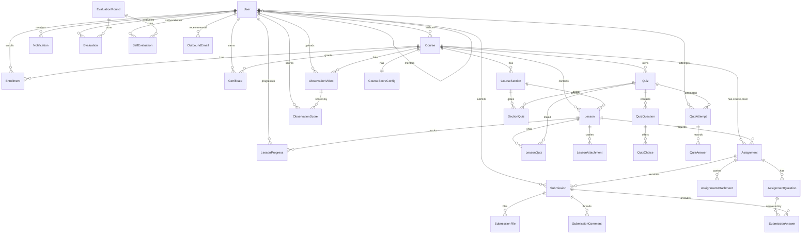

# 02 · Database Schema

Source of truth: [`prisma/schema.prisma`](../prisma/schema.prisma). This document mirrors it; update both or none.

- **Provider**: PostgreSQL 16
- **Client**: `@prisma/client` v6
- **Key strategy**: `Int @default(autoincrement())` everywhere **except** `User`, `ObservationVideo`, `ObservationScore` which use `String @default(cuid())`.
- **Column naming**: snake_case via `@map`.
- **Table naming**: snake_case plural via `@@map`.

## Enums

| Enum | Values |
|------|--------|
| `UserRole` | `STUDENT`, `MENTOR`, `INSTRUCTOR`, `ADMIN` |
| `EnrollmentStatus` | `PENDING`, `APPROVED`, `REJECTED`, `CANCELLED` |
| `CourseLevel` | `BEGINNER`, `INTERMEDIATE`, `ADVANCED` |
| `SubmissionStatus` | `DRAFT`, `SUBMITTED`, `UNDER_REVIEW`, `REVISION_REQUESTED`, `APPROVED`, `REJECTED` |
| `NotificationType` | `SUBMISSION_RECEIVED`, `SUBMISSION_REVIEWED`, `FEEDBACK_RECEIVED`, `REVISION_REQUESTED`, `CERTIFICATE_ISSUED`, `ENROLLMENT_REQUESTED`, `ENROLLMENT_APPROVED`, `ENROLLMENT_REJECTED` |
| `QuizType` | `PRE_TEST`, `POST_TEST`, `QUIZ` |
| `QuizPlacement` | `BEFORE`, `AFTER` |
| `AssignmentAttachmentKind` | `PROMPT`, `GUIDE`, `EXAMPLE` |
| `QuestionResponseType` | `TEXT`, `FILE`, `BOTH` |
| `AttachmentVisibility` | `STUDENT_ANYTIME`, `STUDENT_AFTER_SUBMIT`, `STUDENT_AFTER_APPROVED`, `INTERNAL_ONLY` |
| `EmailStatus` | `PENDING`, `SENT`, `FAILED` |

## Entity-relationship diagram

## Models (29)

### Identity

- **`User`** (`users`) — id (cuid), email (unique), passwordHash, fullName, role, groupName?, isActive, createdAt, updatedAt, mentorId? → User (self-relation `"Mentorship"` with `onDelete: SetNull`).

### Course graph

- **`Course`** (`courses`) — id, title, slug (unique), description?, coverImageKey?, category?, level (CourseLevel?), authorId? → User, isPublished, publishedAt?, requiresApproval (default `true`), `preTestQuizId?` → Quiz, `postTestQuizId?` → Quiz, timestamps. Back-relation `scoreConfig → CourseScoreConfig`.

- **`CourseScoreConfig`** (`course_score_configs`) — id, courseId (unique), lessonQuizWeight Float (default 25), sectionQuizWeight Float (default 25), lessonAssignmentWeight Float (default 25), courseAssignmentWeight Float (default 25), updatedAt. `onDelete: Cascade`. Auto-upserted on first `getStudentCourseScore` call.

- **`CourseSection`** (`course_sections`) — id, courseId, title, description?, order, timestamps. Index `[courseId, order]`.

- **`Lesson`** (`lessons`) — id, courseId, sectionId?, title, content (text), youtubeUrl?, estimatedMinutes?, order, timestamps. Index `[courseId, order]`.

- **`LessonAttachment`** (`lesson_attachments`) — id, lessonId, fileName, fileKey, fileSize, mimeType, createdAt.

### Enrollment & progress

- **`Enrollment`** (`enrollments`) — id, userId, courseId, status (EnrollmentStatus, default PENDING), requestedAt, reviewedAt?, reviewedById?, rejectReason?. Unique `[userId, courseId]`. Index `[courseId, status]`.

- **`LessonProgress`** (`lesson_progress`) — id, userId, lessonId, isCompleted, completedAt?, createdAt. Unique `[userId, lessonId]`.

### Assignments & submissions

- **`Assignment`** (`assignments`) — id, lessonId? (null = course-level), courseId? (set when lessonId is null), title, description, maxFileSize (default 10 MB), allowedTypes (default pdf/jpeg/png), dueDate?, **maxScore Float?** (denominator for score normalisation), createdAt.

  > Two scopes: lesson-level (`lessonId = <id>`, `courseId = null`) and course-level (`lessonId = null`, `courseId = <id>`). The application layer enforces "exactly one scope set".

- **`AssignmentQuestion`** (`assignment_questions`) — id, assignmentId, order, prompt (text), responseType (QuestionResponseType, default TEXT), required, maxLength?, maxFiles?. Index `[assignmentId, order]`.

- **`AssignmentAttachment`** (`assignment_attachments`) — id, assignmentId, kind (AssignmentAttachmentKind), fileName, fileKey, fileSize, mimeType, uploadedById → User, visibility (AttachmentVisibility, default `STUDENT_ANYTIME`), createdAt. Index `[assignmentId, kind]`.

- **`Submission`** (`submissions`) — id, assignmentId, studentId, status (SubmissionStatus, default DRAFT), score?, maxScore?, feedback?, reviewedBy?, reviewedAt?, submittedAt?, firstSubmittedAt?, reviewCycle (default 1), updatedAt. Has relations: `files`, `comments`, `answers`.

- **`SubmissionAnswer`** (`submission_answers`) — id, submissionId, questionId, textAnswer?. Unique `[submissionId, questionId]`. Has `files SubmissionFile[]` (per-answer file attachments).

- **`SubmissionFile`** (`submission_files`) — id, submissionId, answerId? (optional FK to `SubmissionAnswer`), fileName, fileKey, fileSize, mimeType, uploadedAt.

- **`SubmissionComment`** (`submission_comments`) — id, submissionId, authorId, content, isInternal (default false), createdAt.

### Quizzes

- **`Quiz`** (`quizzes`) — id, title, type (QuizType, default QUIZ), maxAttempts (0 = unlimited), passingScore (default 60), isCourseGate (default false), courseId?, createdAt. Back-relations: `coursesAsPreTest`, `coursesAsPostTest`.

- **`QuizQuestion`** (`quiz_questions`) — id, quizId, questionText, points (default 1), order.

- **`QuizChoice`** (`quiz_choices`) — id, questionId, choiceText, isCorrect.

- **`LessonQuiz`** (`lesson_quizzes`) — id, lessonId, quizId, order. Unique `[lessonId, quizId]`.

- **`SectionQuiz`** (`section_quizzes`) — id, sectionId, quizId, placement (QuizPlacement, default `AFTER`), order, isGate (default true). Unique `[sectionId, quizId]`.

- **`QuizAttempt`** (`quiz_attempts`) — id, quizId, studentId, attemptNo, score?, totalPoints?, percentage?, isPassed?, isSubmitted, startedAt, submittedAt?. Unique `[quizId, studentId, attemptNo]`.

- **`QuizAnswer`** (`quiz_answers`) — id, attemptId, questionId, choiceId. Unique `[attemptId, questionId]`.

### Certificates

- **`Certificate`** (`certificates`) — id, userId, courseId, fileKey, issuedAt. Unique `[userId, courseId]`.

### Evaluation

- **`EvaluationRound`** (`evaluation_rounds`) — id, name, startDate, endDate, maxScore (default 100), isActive, description?, rubricJson? (Json), createdAt.

- **`Evaluation`** (`evaluations`) — id, roundId, evaluatorId, evaluateeId, score, feedback?, timestamps. Unique `[roundId, evaluatorId, evaluateeId]`.

- **`SelfEvaluation`** (`self_evaluations`) — id, roundId, userId, score, reflection?, createdAt. Unique `[roundId, userId]`.

### Video corpus

- **`ObservationVideo`** (`observation_videos`) — id (cuid), uploaderId, courseId?, title, description?, fileKey? | youtubeUrl?, durationSec?, createdAt.

- **`ObservationScore`** (`observation_scores`) — id (cuid), videoId, evaluatorId, score (Int), feedback?, createdAt. Unique `[videoId, evaluatorId]`.

### Notifications & email

- **`Notification`** (`notifications`) — id, userId, type (NotificationType), title, message, link?, isRead, createdAt. Index `[userId, isRead]`.

- **`OutboundEmail`** (`outbound_emails`) — id, toUserId, templateKey, payloadJson, status (EmailStatus, default PENDING), attempts (default 0), createdAt, sentAt?. Index `[status, createdAt]`. Flushed by `POST /api/email/flush`.

## Notable design points

1. **Mixed key types**. Most models use `Int autoincrement`; user-linked resources that benefit from opacity (`User`, `ObservationVideo`, `ObservationScore`) use `cuid()`.
2. **Mentor relationship** is a self-FK on `User.mentorId`. `canAccessStudent` in `lib/permissions.ts` enforces MENTOR ↔ STUDENT scoping.
3. **Course `requiresApproval`** defaults `true`; `Enrollment.status` defaults to `PENDING`.
4. **Assignment dual-scope** — `lessonId` nullable, `courseId` optional FK. Application layer enforces exactly one is set. See `docs/decisions/ADR-006`.
5. **CourseScoreConfig** — auto-upserted on first score calculation call; stores 4 Float weights (default 25 each). Redistribution of null components happens at compute time only. See `docs/decisions/ADR-005`.
6. **Quiz gating** is expressed via `Quiz.isCourseGate`, `SectionQuiz.isGate`, and `Quiz.type`. Enforcement lives in `lib/course-gates.ts`.
7. **Soft-delete** is not modelled — deletions cascade (`onDelete: Cascade`) for child rows; `User → Course.author` and similar reviewer FKs are `SetNull` to preserve content when an account is removed.

## Migrations

Three migrations as of 2026-04-19:
- `20260418085821_init` — full initial schema
- `20260418111121_course_assignment` — `lessonId` nullable + `courseId` FK on `Assignment`
- `20260419085544_add_course_score_config` — `CourseScoreConfig` model + `Assignment.maxScore`

Managed by `prisma migrate dev`. Production uses `prisma migrate deploy` (wired into `npm run build`).

Seed data: `prisma/seed.ts` — invoked via `npm run seed`.
