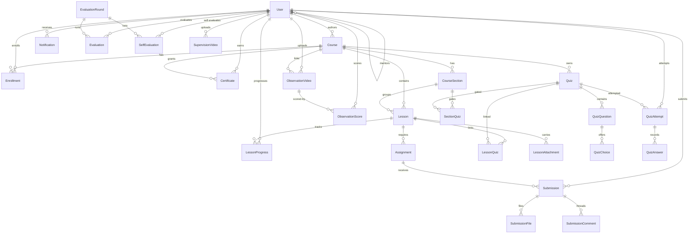

# 02 · Database Schema

Source of truth: [`mini-lms/prisma/schema.prisma`](../mini-lms/prisma/schema.prisma). This document mirrors it; update both or none.

- **Provider**: PostgreSQL 16
- **Client**: `@prisma/client` v6
- **Key strategy**: `Int @default(autoincrement())` everywhere **except** `User`, `ObservationVideo`, `ObservationScore` which use `String @default(cuid())`.
- **Column naming**: snake_case via `@map`.
- **Table naming**: snake_case plural via `@@map`.

## Enums

| Enum | Values |
|------|--------|
| `UserRole` | `STUDENT`, `MENTOR`, `INSTRUCTOR`, `ADMIN` |
| `EnrollmentStatus` | `PENDING`, `APPROVED`, `REJECTED`, `CANCELLED` |
| `CourseLevel` | `BEGINNER`, `INTERMEDIATE`, `ADVANCED` |
| `SubmissionStatus` | `DRAFT`, `SUBMITTED`, `UNDER_REVIEW`, `REVISION_REQUESTED`, `APPROVED`, `REJECTED` |
| `NotificationType` | `SUBMISSION_RECEIVED`, `SUBMISSION_REVIEWED`, `FEEDBACK_RECEIVED`, `REVISION_REQUESTED`, `CERTIFICATE_ISSUED`, `ENROLLMENT_REQUESTED`, `ENROLLMENT_APPROVED`, `ENROLLMENT_REJECTED` |
| `QuizType` | `PRE_TEST`, `POST_TEST`, `QUIZ` |
| `QuizPlacement` | `BEFORE`, `AFTER` |
| `AssignmentAttachmentKind` | `PROMPT`, `GUIDE`, `EXAMPLE` |
| `AttachmentVisibility` | `STUDENT_ANYTIME`, `STUDENT_AFTER_SUBMIT`, `STUDENT_AFTER_APPROVED`, `INTERNAL_ONLY` |

## Entity-relationship diagram

## Models (25)

### Identity

- **`User`** (`users`) — id (cuid), email (unique), passwordHash, fullName, role, groupName?, isActive, createdAt, updatedAt, mentorId? → User (self-relation `"Mentorship"` with `onDelete: SetNull`).

### Course graph

- **`Course`** (`courses`) — id, title, slug (unique), description?, coverImageKey?, category?, level (CourseLevel?), authorId? → User, isPublished, publishedAt?, requiresApproval (default `true`), `preTestQuizId?` → Quiz (`onDelete: SetNull`, rel `"CoursePreTest"`), `postTestQuizId?` → Quiz (`onDelete: SetNull`, rel `"CoursePostTest"`), timestamps.
- **`CourseSection`** (`course_sections`) — id, courseId, title, description?, order, timestamps. Index `[courseId, order]`.
- **`Lesson`** (`lessons`) — id, courseId, sectionId?, title, content (text), youtubeUrl?, estimatedMinutes?, order, timestamps. Index `[courseId, order]`.
- **`LessonAttachment`** (`lesson_attachments`) — id, lessonId, fileName, fileKey, fileSize, mimeType, createdAt.

### Enrollment & progress

- **`Enrollment`** (`enrollments`) — id, userId, courseId, status (EnrollmentStatus, default PENDING), requestedAt, reviewedAt?, reviewedById?, rejectReason?. Unique `[userId, courseId]`. Index `[courseId, status]`.
- **`LessonProgress`** (`lesson_progress`) — id, userId, lessonId, isCompleted, completedAt?, createdAt. Unique `[userId, lessonId]`.

### Assignments & submissions

- **`Assignment`** (`assignments`) — id, lessonId, title, description, maxFileSize (default 10 MB — *DB default; actual per-upload cap for `submissions/` prefix is 50 MB and for `assignments/` prefix is 25 MB, enforced in `/api/upload`*), allowedTypes (default `["application/pdf","image/jpeg","image/png"]`), dueDate?, createdAt.
- **`AssignmentAttachment`** (`assignment_attachments`) — id, assignmentId, kind (AssignmentAttachmentKind), fileName, fileKey, fileSize, mimeType, uploadedById → User, visibility (AttachmentVisibility, default `STUDENT_ANYTIME`), createdAt. Index `[assignmentId, kind]`. Admin/instructor-uploaded prompt / guide / example files attached to an assignment.
- **`Submission`** (`submissions`) — id, assignmentId, studentId, status (SubmissionStatus, default DRAFT), score?, maxScore?, feedback?, reviewedBy?, reviewedAt?, submittedAt?, firstSubmittedAt?, reviewCycle (default 1), updatedAt.
- **`SubmissionFile`** (`submission_files`) — id, submissionId, fileName, fileKey, fileSize, mimeType, uploadedAt.
- **`SubmissionComment`** (`submission_comments`) — id, submissionId, authorId, content, isInternal (default false), createdAt.

### Quizzes

- **`Quiz`** (`quizzes`) — id, title, type (QuizType, default QUIZ), maxAttempts (0 = unlimited), passingScore (default 60), isCourseGate (default false), courseId?, createdAt. Back-relations: `coursesAsPreTest`, `coursesAsPostTest` (for Course's 1-to-1 Pre/Post FKs).
- **`QuizQuestion`** (`quiz_questions`) — id, quizId, questionText, points (default 1), order.
- **`QuizChoice`** (`quiz_choices`) — id, questionId, choiceText, isCorrect.
- **`LessonQuiz`** (`lesson_quizzes`) — id, lessonId, quizId, order. Unique `[lessonId, quizId]`.
- **`SectionQuiz`** (`section_quizzes`) — id, sectionId, quizId, placement (QuizPlacement, default `AFTER`), order, isGate (default true). Unique `[sectionId, quizId]`. The "at most one BEFORE + one AFTER per section" rule is enforced at the app layer (server actions), not the schema.
- **`QuizAttempt`** (`quiz_attempts`) — id, quizId, studentId, attemptNo, score?, totalPoints?, percentage?, isPassed?, isSubmitted, startedAt, submittedAt?. Unique `[quizId, studentId, attemptNo]`.
- **`QuizAnswer`** (`quiz_answers`) — id, attemptId, questionId, choiceId. Unique `[attemptId, questionId]`.

### Certificates

- **`Certificate`** (`certificates`) — id, userId, courseId, fileKey, issuedAt. Unique `[userId, courseId]`.

### Evaluation

- **`EvaluationRound`** (`evaluation_rounds`) — id, name, startDate, endDate, maxScore (default 100), isActive, description?, rubricJson? (Json), createdAt.
- **`Evaluation`** (`evaluations`) — id, roundId, evaluatorId, evaluateeId, score, feedback?, timestamps. Unique `[roundId, evaluatorId, evaluateeId]`.
- **`SelfEvaluation`** (`self_evaluations`) — id, roundId, userId, score, reflection?, createdAt. Unique `[roundId, userId]`.

### Video corpus

- **`SupervisionVideo`** (`supervision_videos`) — id, uploaderId, title, description?, fileKey? | youtubeUrl?, duration?, createdAt. *Legacy table — see notes.*
- **`ObservationVideo`** (`observation_videos`) — id (cuid), uploaderId, courseId?, title, description?, fileKey? | youtubeUrl?, durationSec?, createdAt.
- **`ObservationScore`** (`observation_scores`) — id (cuid), videoId, evaluatorId, score (Int), feedback?, createdAt. Unique `[videoId, evaluatorId]`.

### Notifications

- **`Notification`** (`notifications`) — id, userId, type (NotificationType), title, message, link?, isRead, createdAt. Index `[userId, isRead]`.

## Notable design points

1. **Mixed key types**. Most models use `Int autoincrement` for performance and URL brevity; user-linked resources that are shared/shareable by URL or that require opacity (`User`, `ObservationVideo`, `ObservationScore`) use `cuid()`. This is intentional — do not "normalise" without migration planning.
2. **Mentor relationship** is a self-FK on `User.mentorId`. `canAccessStudent` in `lib/permissions.ts` enforces MENTOR ↔ STUDENT scoping.
3. **Course `requiresApproval`** defaults `true`; `Enrollment.status` defaults to `PENDING`. Bypass path for "instant enrol" courses is conditional on `requiresApproval = false` (see [07-backlog.md](./07-backlog.md) for the planned approval UX work).
4. **SupervisionVideo vs. ObservationVideo** — two co-existing tables. `SupervisionVideo` is legacy (video corpus from v2); new work goes to `ObservationVideo`. Consolidation is tracked in [06-implementation-plan.md](./06-implementation-plan.md).
5. **Quiz gating** is expressed via `Quiz.isCourseGate`, `SectionQuiz.isGate`, and `Quiz.type` (PRE_TEST / POST_TEST). Enforcement lives in `lib/course-gates.ts`.
6. **Soft-delete** is not modelled — deletions cascade (`onDelete: Cascade`) for child rows; `User → Course.author` and `User → Enrollment.reviewedBy` are `SetNull` to preserve authored content when an account is removed.

## Shipped additions (as of 2026-04-18)

The following design items from [08-quiz-assignment-plan.md](./08-quiz-assignment-plan.md) are **applied and live** in `schema.prisma`:

- `enum QuizPlacement { BEFORE, AFTER }`
- `SectionQuiz.placement` (default `AFTER`, covers existing rows)
- `Course.preTestQuizId`, `Course.postTestQuizId` (nullable FKs to `Quiz`, `onDelete: SetNull`)
- `enum AssignmentAttachmentKind { PROMPT, GUIDE, EXAMPLE }`
- `enum AttachmentVisibility { STUDENT_ANYTIME, STUDENT_AFTER_SUBMIT, STUDENT_AFTER_APPROVED, INTERNAL_ONLY }`
- `AssignmentAttachment` model

## Migrations

As of 2026-04-18 the `prisma/migrations/` folder is managed by `prisma migrate dev`. Build runs `prisma migrate deploy` (see `package.json > scripts.build`).

Seed data: `prisma/seed.ts` (invoked via `npm run seed`).
