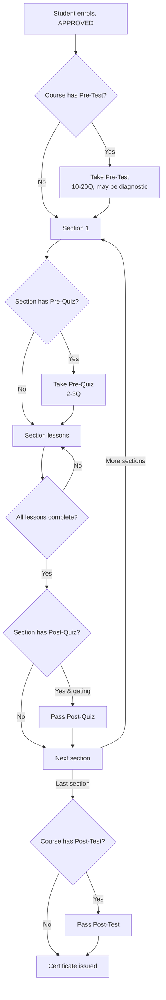

# 08 · Quiz & Assignment — Design & Implementation Record

> **Status: SHIPPED (Phase 1, 2026-04-18).**
> Tasks Q-1..Q-13 are all complete — verified in the 2026-04-18 code audit against `mini-lms/`. See [06-implementation-plan.md §0](./06-implementation-plan.md#0-what-shipped-in-phase-1-2026-04-16--2026-04-18) for the roll-up.
> This document is kept as the **design-rationale reference** (MinIO layout, user flow, access rules). Do not treat §7 as a live task list — those rows have all moved to 06.

## Quick status (audit 2026-04-18)

| ID | Task | Status |
|----|------|--------|
| Q-1 | Prisma migration for `QuizPlacement`, `SectionQuiz.placement`, `Course.preTest/PostTestQuizId`, `AssignmentAttachment` | ✅ `prisma/schema.prisma` |
| Q-2 | Backfill `SectionQuiz.placement = AFTER` | ✅ default value on column |
| Q-3 | Course-level quiz builder + 10–20 Q validator | ✅ `lib/validators/quiz.ts::courseQuizSchema` |
| Q-4 | Section-level quiz builder + 2–3 Q validator | ✅ `lib/validators/quiz.ts::sectionQuizSchema` |
| Q-5 | Assignment attachments panel | ✅ `app/teach/[courseId]/assignments/[id]/_components/attachment-upload-panel.tsx` |
| Q-6 | `assignments` upload prefix | ✅ `app/api/upload/route.ts::PREFIX_CONFIG["assignments"]` (25 MB, `needsAuthor`) |
| Q-7 | Placement-aware `lib/course-gates.ts` | ✅ `canEnterSection`, `isSectionComplete`, `canAccessLesson`, `canAccessPostTest` |
| Q-8 | Sidebar quiz-state badge | ✅ inline in `app/courses/[slug]/page.tsx` (extraction is 06 P1-11 polish) |
| Q-9 | `AttachmentVisibility` enforcement on preview | ✅ `app/api/files/preview/[...key]/route.ts` — gap on `/api/files/[...key]` is tracked as 06 P0-6 |
| Q-10 | Certificate requires course Post-Test | ✅ `lib/certificate.ts::checkCourseCompletion` (FK + POST_TEST fallback) |
| Q-11 | Pre/Post delta in reports + XLSX export | ✅ `/api/export/quiz-attempts` adds `pre_score`, `post_score`, `delta` |
| Q-12 | `deleteByPrefix()` + wiring | ✅ `lib/minio.ts::deleteByPrefix` (paginated, 1000 per batch) |
| Q-13 | Docs updated | ✅ 02, 04, 06 reflect shipped state on 2026-04-18 |

---


## 1. Goals

1. **Course-level assessments** — a **Pre-Test** (diagnostic, opens on enrollment) and a **Post-Test** (final gate, required for certificate). **10–20** multiple-choice questions each. Admin / instructor chooses count, passing score, attempts.
2. **Section-level assessments** — each `CourseSection` can carry its own **Pre-quiz** (readiness check) and **Post-quiz** (knowledge check that unlocks the next section). **2–3** multiple-choice questions each.
3. **Assignment materials** — admin / instructor can attach **reference files** to an `Assignment` (question prompt, answer guide, rubric, sample solution). Students continue to upload their own answer files as today.
4. **MinIO organisation** — explicit prefix layout + lifecycle rules so files don't get orphaned.

## 2. What already exists

| Concern | Current support | Gap for this plan |
|---------|-----------------|-------------------|
| `Quiz.type` enum (`PRE_TEST`, `POST_TEST`, `QUIZ`) | ✅ | Nothing — reuse as-is |
| `Quiz.isCourseGate` | ✅ flag only | No explicit 1-to-1 binding between a `Course` and its Pre/Post quizzes |
| `SectionQuiz` join (`isGate`, `order`) | ✅ | No **placement** (before vs after a section) |
| `LessonQuiz` join | ✅ | Out of scope for this plan — stays as the per-lesson checkpoint |
| `Assignment` model | ✅ student submission path | No field for admin-uploaded reference / guide files |
| `/api/upload` purposes (`lessons`, `covers`, `submissions`, `videos`, `profiles`) | ✅ | Missing **`assignments`** purpose prefix |
| Gate logic in `lib/course-gates.ts` | ✅ per-lesson & course gate | Must become **placement-aware** (pre vs post) |

## 3. Proposed schema changes

Additive only. All new columns are nullable or default-safe so existing rows keep working.

```prisma
// NEW — distinguishes pre-section from post-section quizzes.
enum QuizPlacement {
  BEFORE   // pre-quiz: gates entry into the section/course
  AFTER    // post-quiz: gates exit / unlocks next section or certificate
}

model SectionQuiz {
  id        Int           @id @default(autoincrement())
  sectionId Int           @map("section_id")
  quizId    Int           @map("quiz_id")
  placement QuizPlacement @default(AFTER)          // NEW
  order     Int           @default(0)
  isGate    Boolean       @default(true) @map("is_gate")
  // ...existing relations unchanged
  @@unique([sectionId, quizId])
  // @@unique([sectionId, placement]) — ENFORCED IN APP LAYER
  //   (allow at most one BEFORE + one AFTER per section; we don't add the
  //   composite unique because historical rows may violate it).
}

// Course gets explicit 1-to-1 handles for its Pre/Post tests.
model Course {
  // ...existing fields
  preTestQuizId  Int?  @map("pre_test_quiz_id")
  postTestQuizId Int?  @map("post_test_quiz_id")
  preTestQuiz    Quiz? @relation("CoursePreTest",  fields: [preTestQuizId],  references: [id], onDelete: SetNull)
  postTestQuiz   Quiz? @relation("CoursePostTest", fields: [postTestQuizId], references: [id], onDelete: SetNull)
}

// Back-refs on Quiz (so a Quiz row knows when it's being used as a course Pre/Post).
model Quiz {
  // ...existing fields
  coursesAsPreTest  Course[] @relation("CoursePreTest")
  coursesAsPostTest Course[] @relation("CoursePostTest")
}

// NEW — admin/instructor uploads: prompt, guide, sample, rubric.
enum AssignmentAttachmentKind {
  PROMPT   // the question itself as a downloadable file (optional — description field still default)
  GUIDE    // answer guide / rubric / marking scheme
  EXAMPLE  // sample solution shown after submission is approved
}

model AssignmentAttachment {
  id           Int                      @id @default(autoincrement())
  assignmentId Int                      @map("assignment_id")
  kind         AssignmentAttachmentKind
  fileName     String                   @map("file_name")
  fileKey      String                   @map("file_key")
  fileSize     Int                      @map("file_size")
  mimeType     String                   @map("mime_type")
  uploadedById String                   @map("uploaded_by_id")
  visibility   AttachmentVisibility     @default(STUDENT_ANYTIME)
  createdAt    DateTime                 @default(now()) @map("created_at")

  assignment   Assignment               @relation(fields: [assignmentId], references: [id], onDelete: Cascade)
  uploadedBy   User                     @relation(fields: [uploadedById], references: [id])

  @@index([assignmentId, kind])
  @@map("assignment_attachments")
}

enum AttachmentVisibility {
  STUDENT_ANYTIME          // PROMPT, GUIDE (if intended for students from day 1)
  STUDENT_AFTER_SUBMIT     // reveal only once student has SUBMITTED
  STUDENT_AFTER_APPROVED   // reveal only once student is APPROVED (good for EXAMPLE)
  INTERNAL_ONLY            // never shown to students (rubric for graders)
}
```

### Why these shapes

- **`SectionQuiz.placement`**: current `SectionQuiz.isGate` tells you *whether* it gates, but not *which side*. Adding `placement` is the minimum change — we keep `isGate` for backward-compat (pre-quiz may or may not gate depending on `isGate`).
- **`Course.preTestQuizId` / `postTestQuizId`**: a Quiz tagged `type = PRE_TEST` and `isCourseGate = true` today does the job semantically, but nothing enforces "exactly one per course". Explicit FKs make that guarantee and simplify queries (`include: { preTestQuiz: true }` vs filtering a collection).
- **`AssignmentAttachment.visibility`** gives the admin control over when students can see each file — the TOR requirement "admin upload guide answer file" implies some reveal timing is intended.

## 4. Business rules (enforced in UI + server actions, not schema)

| Rule | Layer |
|------|-------|
| Course **Pre-Test**: 10–20 questions, all MCQ, `maxAttempts = 1` by default, `passingScore` optional (may be purely diagnostic) | Quiz builder UI + Zod schema |
| Course **Post-Test**: 10–20 questions, MCQ, `passingScore` required, `isCourseGate = true` | Quiz builder UI + Zod |
| Section **Pre-Quiz**: 2–3 questions, MCQ, `maxAttempts` configurable, default non-gating (`isGate = false`) | Quiz builder UI + Zod |
| Section **Post-Quiz**: 2–3 questions, MCQ, `passingScore` required, gating (`isGate = true`) | Quiz builder UI + Zod |
| Exactly one Pre + one Post per section | Server action validates before insert / update |
| A Quiz linked as a course Pre/Post **cannot** also be linked via `SectionQuiz` | Server action validates |

## 5. User flow



- Pre-quizzes are **transparent**: student can retake until `maxAttempts`. The best attempt is stored; analytics surfaces the delta vs. Post-quiz.
- Post-quizzes are **gating**: failing means retake (subject to `maxAttempts`); after exhaustion, the student sees a helpful state ("contact your mentor").
- Only the **course Post-Test** contributes to `lib/certificate.ts` verification; section post-quizzes gate progression only.

## 6. MinIO file organisation

Single bucket `mini-lms-storage` (from `.env.MINIO_BUCKET`), organised by **purpose prefix** followed by an **entity ID**. Keys are opaque; file names are preserved separately in the DB row.

```
mini-lms-storage/
├── covers/
│   └── <courseId>/<uuid>.{jpg,png,webp}
│
├── lessons/
│   └── <lessonId>/<uuid>.<ext>             # LessonAttachment
│
├── assignments/                             # NEW
│   └── <assignmentId>/
│       ├── prompt/<uuid>.<ext>              # AssignmentAttachment.kind = PROMPT
│       ├── guide/<uuid>.<ext>               #   "                      = GUIDE
│       └── example/<uuid>.<ext>             #   "                      = EXAMPLE
│
├── submissions/
│   └── <submissionId>/<uuid>.<ext>          # SubmissionFile
│
├── videos/
│   └── <observationVideoId>/<uuid>.<ext>    # ObservationVideo
│
├── certificates/
│   └── <userId>/<courseId>.pdf              # Certificate (1-to-1)
│
└── profiles/
    └── <userId>/<uuid>.{jpg,png}
```

### Access rules

| Prefix | Who can GET | Who can PUT | Who can DELETE |
|--------|-------------|-------------|----------------|
| `covers/*` | Anyone (public browsing) | INSTRUCTOR (own course), ADMIN | same |
| `lessons/*` | APPROVED enrollee of course, INSTRUCTOR (own), ADMIN | INSTRUCTOR (own), ADMIN | same |
| `assignments/<id>/prompt/*` | APPROVED enrollee who can see the lesson | INSTRUCTOR (own course), ADMIN | same |
| `assignments/<id>/guide/*` | Depends on `AttachmentVisibility` | INSTRUCTOR (own course), ADMIN | same |
| `assignments/<id>/example/*` | Only after submission is `APPROVED` (server-enforced) | INSTRUCTOR (own course), ADMIN | same |
| `submissions/<id>/*` | Author, mentor-of-author, INSTRUCTOR-of-course, ADMIN | Author (state ∈ DRAFT/REVISION_REQUESTED) | Author (own, DRAFT only), ADMIN |
| `videos/*` | MENTOR, INSTRUCTOR, ADMIN | MENTOR, INSTRUCTOR, ADMIN | Uploader, ADMIN |
| `certificates/*` | Certificate owner, ADMIN | System only (auto-issue) | ADMIN |
| `profiles/*` | Profile owner only (in app); MinIO bucket must NOT expose via public download policy | Profile owner | Profile owner, ADMIN |

All GETs go through `GET /api/files/preview/[...key]` (presigned, 15-min TTL from `FILE_PRESIGN_TTL_SECONDS`). No direct-to-bucket URLs in the UI.

### Lifecycle

- **Deletion**: `onDelete: Cascade` on FKs means DB rows disappear when the parent does. MinIO objects must be deleted too — add a `lib/minio.ts::deleteByPrefix()` helper and call it from server actions that delete an Assignment / Lesson / Submission / Video.
- **Orphan sweep**: scheduled job (see P2-3 in [06-implementation-plan.md](./06-implementation-plan.md)) lists objects under each prefix and reconciles against the DB. Dry-run first.
- **Rotation**: certificates and submissions are immutable — never overwrite; issue a new object with a new uuid if regeneration is needed. The DB row's `fileKey` is rotated atomically.
- **Naming**: always `<uuid>.<ext>` inside the prefix. Original `fileName` lives in the DB only — this avoids encoding headaches with Thai filenames in S3 keys.

## 7. Implementation tasks

Add these to [06-implementation-plan.md](./06-implementation-plan.md) at **P1** (new feature, not security). They decompose into a 2-slice sprint: schema + authoring UI first, then student-side gate enforcement + assignment attachments.

| ID | Slice | Task | DoD |
|----|-------|------|-----|
| Q-1 | schema | Prisma migration: add `QuizPlacement`, `SectionQuiz.placement`, `Course.preTestQuizId`, `Course.postTestQuizId`, `AssignmentAttachment` model + enums | `npx prisma migrate dev` passes; `npm run seed` still runs; Prisma Studio shows new columns |
| Q-2 | schema | Backfill: existing `SectionQuiz` rows → `placement = AFTER` (matches current semantics) | Migration SQL included; no production data lost |
| Q-3 | authoring | Course-level quiz builder tab on `/teach/[courseId]` with Pre/Post tabs, 10–20 Q validator, passing-score input | Zod schema rejects < 10 or > 20; end-to-end: instructor creates Pre + Post, sees them bound to the course |
| Q-4 | authoring | Section-level quiz builder under each section editor with Pre/Post sub-tabs, 2–3 Q validator | Zod schema rejects < 2 or > 3; server action enforces "at most one Pre + one Post per section" |
| Q-5 | authoring | Assignment attachments panel on `/teach/[courseId]/assignments/[id]` — upload files tagged `PROMPT` / `GUIDE` / `EXAMPLE` with visibility picker | Files appear ordered by kind; presigned preview works for instructor |
| Q-6 | upload | Add `"assignments"` to the `/api/upload` purpose whitelist; enforce role + ownership; key under `assignments/<assignmentId>/<kind>/<uuid>` | Unit test blocks STUDENT; accepts INSTRUCTOR-of-course |
| Q-7 | gating | Extend `lib/course-gates.ts` to be placement-aware: section entry requires passing `BEFORE` gate; section exit requires `AFTER`; course lock requires Post-Test | Vitest covers 4 scenarios: pre-fail blocks entry, post-fail blocks exit, post-pass unlocks next section, course post-pass triggers certificate |
| Q-8 | learner UX | `/courses/[slug]/page.tsx` sidebar reflects the four quiz types (course Pre/Post, section Pre/Post) with completion badges | Visual: ⏸ locked, 🧪 diagnostic, ✅ passed, ❌ retake available |
| Q-9 | learner UX | Student can download `GUIDE` / `EXAMPLE` assignment attachments respecting `AttachmentVisibility` | `STUDENT_AFTER_APPROVED` example file is hidden until submission status = APPROVED |
| Q-10 | scoring | `lib/certificate.ts` verification now requires the course Post-Test passed in addition to all sections complete | Existing certificate test suite extended; re-issuing is still idempotent |
| Q-11 | reports | Quiz analytics on `/reports/progress` — Pre vs Post delta per student, group averages | New columns on XLSX export from `/api/export/quiz-attempts` |
| Q-12 | ops | MinIO `lib/minio.ts::deleteByPrefix()` helper + wire into delete actions for Assignment, Lesson, Submission, Video | Vitest + one integration test against a local MinIO container |
| Q-13 | docs | Update [04-features.md](./04-features.md) §6 + §8 and [02-database-schema.md](./02-database-schema.md) to reflect shipped state | Docs say ✅ once Q-1..Q-10 land |

### Suggested order

1. **Q-1, Q-2** — migration lands first; no behaviour change until UI/consumers use the new columns.
2. **Q-3, Q-4** — authoring side next so data can be entered.
3. **Q-6, Q-5** — upload endpoint then attachment panel.
4. **Q-7, Q-8, Q-9** — learner experience wires up.
5. **Q-10** — tightens certificate rules (do last to avoid breaking existing students mid-work).
6. **Q-11, Q-12, Q-13** — polish, ops, docs.

## 8. Out of scope (explicitly)

- Non-MCQ question types (true/false, short answer, matching) — tracked in [06 P3-1 / P3-2](./06-implementation-plan.md).
- Automated essay grading on assignment text.
- Question banks / randomised question sampling (each quiz has its own fixed set today).
- Question-level analytics (item difficulty, discrimination index).

## 9. Risks

| Risk | Mitigation |
|------|------------|
| Existing section quizzes with `placement` absent get labelled `AFTER` by the backfill — but one was secretly meant as a pre-quiz | Admin review list after migration: "Unreviewed section quizzes". Default is conservative (AFTER / gating). |
| 10–20 Q constraint is arbitrary and might collide with short pilot courses | Make the bounds **config constants** in `lib/validators/quiz.ts`, not hard-coded in the UI. Override via env `QUIZ_COURSE_MIN/MAX`, `QUIZ_SECTION_MIN/MAX` if pilots need flexibility. |
| `AttachmentVisibility` reveals sample answers too early | Server-side gate, not client-side hide. Presign endpoint checks visibility before returning a URL. |
| MinIO prefix rename breaks old objects | No rename for existing prefixes. New prefix `assignments/` is additive; nothing to migrate. |
| Prisma self-FK cycles (Course → Quiz → Course) | Resolved by `onDelete: SetNull` on `preTestQuizId` / `postTestQuizId`. Seed script avoids the cycle by creating quizzes first, courses second. |
