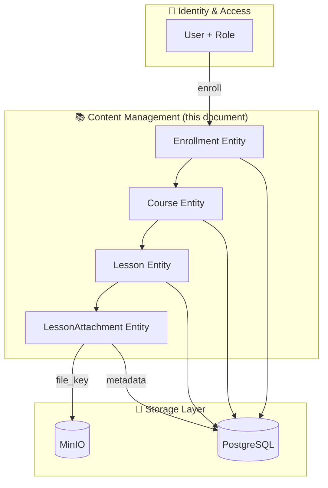
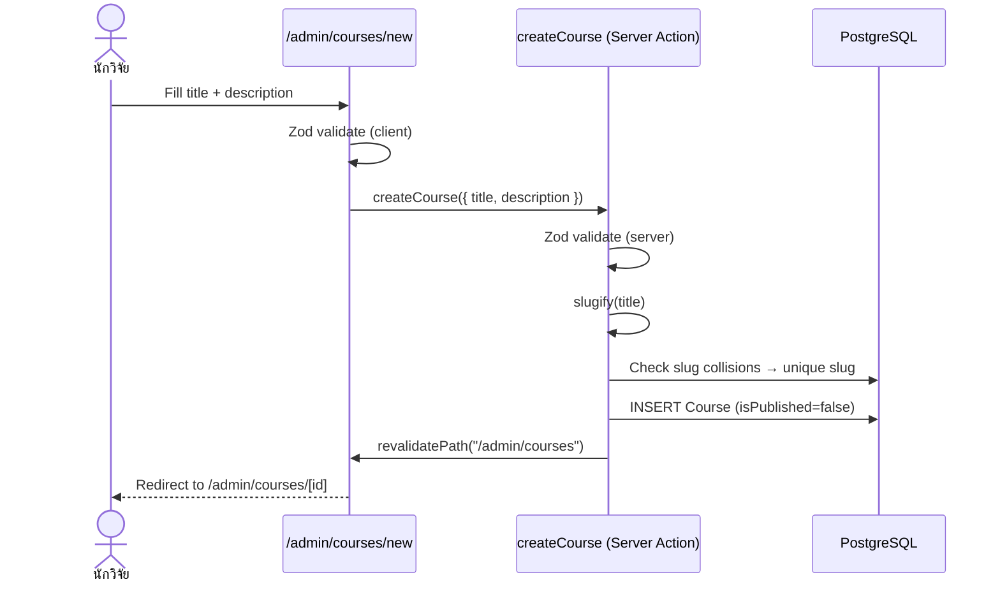
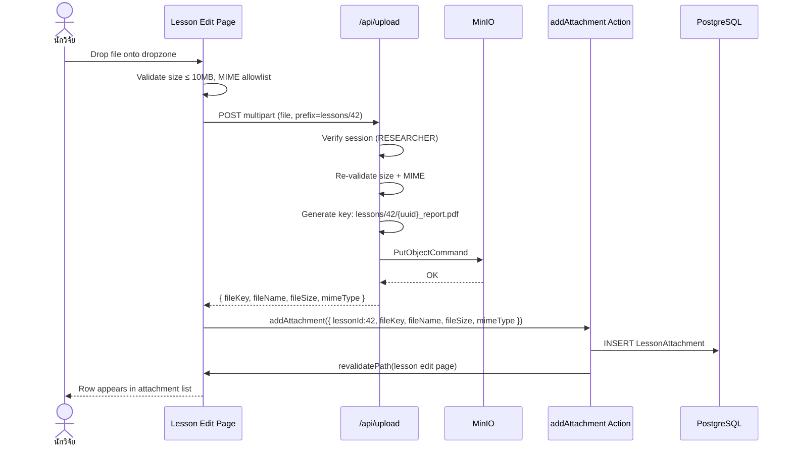
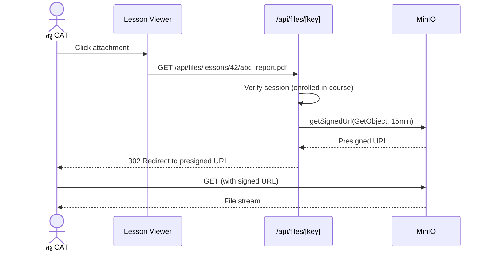
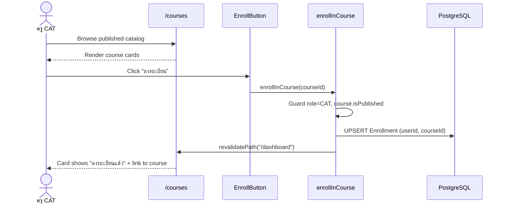

# Mini LMS v2 — Course & Content Management
## Detailed System Architecture & Implementation Plan

> **Scope:** Spec Section 2.2 — US-COURSE-01 ถึง US-COURSE-04
> **Stack:** Next.js 16 (App Router) + TypeScript + Prisma + PostgreSQL + MinIO + NextAuth
> **Version:** 1.0 | **Date:** 2026-04-16
> **Parent Docs:** `mini-lms-architecture-v2.md`, `mini-lms-spec-v2.md`

---

## 1. Scope & Objectives

This document details architecture and implementation for **Course & Content Management** covering four use cases:

| Story | Title | Primary Actor |
|-------|-------|---------------|
| **US-COURSE-01** | Create/Edit Course | นักวิจัย (Researcher) |
| **US-COURSE-02** | Manage Lessons | นักวิจัย (Researcher) |
| **US-COURSE-03** | Upload Teaching Materials | นักวิจัย (Researcher) |
| **US-COURSE-04** | Enroll in Course | ครู CAT (Trainee) |

### 1.1 Out of Scope for this document
- Assignment workflow (see US-ASSIGN-\*)
- Quiz / Assessment engine (see US-QUIZ-\*)
- Lesson progress tracking logic (see US-PROG-\*)
- Certificate generation (see US-CERT-\*)

---

## 2. Bounded Context



---

## 3. Data Model (Relevant Slice)

The following Prisma models (already defined in the parent schema) are in scope:

```prisma
model Course {
  id          Int       @id @default(autoincrement())
  title       String
  slug        String    @unique
  description String?
  isPublished Boolean   @default(false) @map("is_published")
  createdAt   DateTime  @default(now())  @map("created_at")
  updatedAt   DateTime  @updatedAt        @map("updated_at")

  lessons     Lesson[]
  enrollments Enrollment[]

  @@map("courses")
}

model Lesson {
  id         Int      @id @default(autoincrement())
  courseId   Int      @map("course_id")
  title      String
  content    String   @db.Text   // MDX
  youtubeUrl String?  @map("youtube_url")
  order      Int
  createdAt  DateTime @default(now()) @map("created_at")
  updatedAt  DateTime @updatedAt       @map("updated_at")

  course      Course              @relation(fields: [courseId], references: [id], onDelete: Cascade)
  attachments LessonAttachment[]

  @@index([courseId, order])
  @@map("lessons")
}

model LessonAttachment {
  id        Int      @id @default(autoincrement())
  lessonId  Int      @map("lesson_id")
  fileName  String   @map("file_name")
  fileKey   String   @map("file_key")     // MinIO object key
  fileSize  Int      @map("file_size")    // bytes
  mimeType  String   @map("mime_type")
  createdAt DateTime @default(now()) @map("created_at")

  lesson Lesson @relation(fields: [lessonId], references: [id], onDelete: Cascade)

  @@map("lesson_attachments")
}

model Enrollment {
  id         Int      @id @default(autoincrement())
  userId     String   @map("user_id")
  courseId   Int      @map("course_id")
  enrolledAt DateTime @default(now()) @map("enrolled_at")

  user   User   @relation(fields: [userId], references: [id], onDelete: Cascade)
  course Course @relation(fields: [courseId], references: [id], onDelete: Cascade)

  @@unique([userId, courseId])
  @@map("enrollments")
}
```

### 3.1 Invariants

| Invariant | Enforcement |
|-----------|-------------|
| `Course.slug` unique | DB `@unique` + server-side collision check with retry |
| `isPublished = false` implies invisible to CAT | Query filter in CAT-facing pages |
| `Enrollment(userId, courseId)` unique | DB `@@unique` + idempotent server action |
| `Lesson.order` not required unique, but should be stable within a course | UI auto-numbers; server normalizes on reorder |
| `LessonAttachment.fileSize <= 10_485_760` (10 MB) | Validated pre-upload (client) + on `/api/upload` (server) |
| MIME allowlist for materials | Enforced in upload handler |

---

## 4. Route / Page Inventory (for this slice)

| Route | Rendering | Role | Purpose |
|-------|-----------|------|---------|
| `/admin/courses` | SSR | RESEARCHER | Course list with CRUD actions |
| `/admin/courses/new` | SSR + Client form | RESEARCHER | Create new course |
| `/admin/courses/[id]` | SSR + Client form | RESEARCHER | Edit course + manage lessons |
| `/admin/courses/[id]/lessons/new` | SSR + Client form | RESEARCHER | Create lesson |
| `/admin/courses/[id]/lessons/[lessonId]` | SSR + Client form | RESEARCHER | Edit lesson + attachments |
| `/courses` | SSR | ALL | Catalog (CAT sees published; RES manages) |
| `/courses/[slug]` | SSR | CAT, RES | Course overview + enroll button |
| `/courses/[slug]/lessons/[lessonId]` | SSR | CAT | Lesson viewer (consumers of content) |
| `/dashboard` (CAT section) | SSR | CAT | "My Courses" list with completion state |
| `/api/upload` | Route Handler | AUTH | Receives multipart upload → MinIO |
| `/api/files/[key]` | Route Handler | AUTH | Streams / redirects to presigned MinIO URL |

---

## 5. Server Actions & APIs

### 5.1 Course Actions — `app/admin/courses/actions.ts`

| Action | Input | Output | Role | Notes |
|--------|-------|--------|------|-------|
| `createCourse` | `{ title, description? }` | `Course` | RESEARCHER | Slug auto-generated from title; uniqueness enforced |
| `updateCourse` | `{ id, title?, description?, slug? }` | `Course` | RESEARCHER | Slug changes re-checked for uniqueness |
| `togglePublish` | `{ id, isPublished }` | `Course` | RESEARCHER | Guards against publishing courses with zero lessons (optional warning) |
| `deleteCourse` | `{ id }` | `void` | RESEARCHER | Cascade deletes lessons, attachments (MinIO cleanup job) |

### 5.2 Lesson Actions — `app/admin/courses/[id]/lessons/[lessonId]/actions.ts`

| Action | Input | Output | Role |
|--------|-------|--------|------|
| `createLesson` | `{ courseId, title, content, youtubeUrl?, order? }` | `Lesson` | RESEARCHER |
| `updateLesson` | `{ id, title?, content?, youtubeUrl?, order? }` | `Lesson` | RESEARCHER |
| `reorderLessons` | `{ courseId, orderedIds: number[] }` | `Lesson[]` | RESEARCHER |
| `deleteLesson` | `{ id }` | `void` | RESEARCHER |
| `addAttachment` | `{ lessonId, fileKey, fileName, fileSize, mimeType }` | `LessonAttachment` | RESEARCHER |
| `removeAttachment` | `{ attachmentId }` | `void` | RESEARCHER (also deletes MinIO object) |

### 5.3 Enrollment Actions — `app/courses/[slug]/actions.ts`

| Action | Input | Output | Role |
|--------|-------|--------|------|
| `enrollInCourse` | `{ courseId }` | `Enrollment` | CAT (idempotent) |
| `unenrollFromCourse` | `{ courseId }` | `void` | CAT (optional / soft) |

### 5.4 File Upload API — `app/api/upload/route.ts`

```
POST /api/upload
Content-Type: multipart/form-data
Body:
  - file: File (required)
  - prefix: "lessons/{lessonId}" (required, whitelisted)
Response:
  200 { fileKey, fileName, fileSize, mimeType }
  400 { error: "FILE_TOO_LARGE" | "MIME_NOT_ALLOWED" | "BAD_PREFIX" }
  401 { error: "UNAUTHORIZED" }
  403 { error: "FORBIDDEN" }
```

**Server-side guards (for teaching materials):**
- `session.user.role === "RESEARCHER"`
- `file.size <= 10 * 1024 * 1024`
- `file.type ∈ { application/pdf, application/vnd.openxmlformats-officedocument.wordprocessingml.document, application/vnd.ms-excel, application/vnd.openxmlformats-officedocument.spreadsheetml.sheet, application/vnd.ms-powerpoint, application/vnd.openxmlformats-officedocument.presentationml.presentation, image/png, image/jpeg, text/plain, application/zip }`
- `prefix` must match `^lessons/\d+$`
- Generated object key: `lessons/{lessonId}/{uuid}_{sanitizedFileName}`

---

## 6. Use Case Deep-Dives

### 6.1 US-COURSE-01 — Create/Edit Course

#### Acceptance Criteria Mapping
| AC | Implementation |
|----|----------------|
| Fields: title (required), description, slug (auto) | Zod schema on form + `createCourse`; slug via `slugify(title)` + collision retry |
| Publish/unpublish | `isPublished` toggle on `/admin/courses/[id]`; uses `togglePublish` |
| Only published visible to CAT | Page queries: `where: { isPublished: true }` when `role === "CAT"` |
| Slug unique — duplicates rejected | DB constraint; action surfaces `SLUG_TAKEN` error |

#### Slug Generation Algorithm

```typescript
// lib/slug.ts
export function slugify(input: string): string {
  return input
    .toLowerCase()
    .normalize("NFKD")
    .replace(/[\u0E00-\u0E7F]/g, (ch) => ch)     // preserve Thai
    .replace(/[^\p{L}\p{N}\s-]/gu, "")
    .trim()
    .replace(/\s+/g, "-")
    .replace(/-+/g, "-");
}

export async function uniqueSlug(base: string, prisma: PrismaClient): Promise<string> {
  let slug = base || "course";
  let i = 1;
  while (await prisma.course.findUnique({ where: { slug } })) {
    slug = `${base}-${i++}`;
  }
  return slug;
}
```

#### Sequence — Create Course



---

### 6.2 US-COURSE-02 — Manage Lessons

#### Acceptance Criteria Mapping
| AC | Implementation |
|----|----------------|
| Fields: title, content (MDX), youtube_url, order | Prisma `Lesson` model + form |
| Markdown + Shiki code highlighting | `react-markdown` + `rehype-pretty-code` + `shiki` themes |
| YouTube embedded player | `<iframe>` component parsing YouTube URL (watch / youtu.be / shorts) |
| Sidebar ordered by `order` | Prisma query `orderBy: { order: "asc" }` + compound index |

#### Markdown Rendering Pipeline (`components/markdown-renderer.tsx`)

```typescript
<ReactMarkdown
  remarkPlugins={[remarkGfm]}
  rehypePlugins={[
    rehypeSlug,
    [rehypePrettyCode, {
      theme: "github-dark",
      keepBackground: true,
    }],
  ]}
  components={{
    a: ({ href, children }) => <YouTubeOrAnchor href={href}>{children}</YouTubeOrAnchor>,
  }}
/>
```

#### YouTube URL Handling

```typescript
// lib/youtube.ts
export function extractYouTubeId(url: string): string | null {
  const patterns = [
    /(?:youtube\.com\/watch\?v=|youtu\.be\/|youtube\.com\/embed\/|youtube\.com\/shorts\/)([A-Za-z0-9_-]{11})/,
  ];
  for (const p of patterns) {
    const m = url.match(p);
    if (m) return m[1];
  }
  return null;
}
```

When `youtubeUrl` is present on a Lesson, render a dedicated `<YouTubePlayer>` above the Markdown content:

```tsx
<iframe
  src={`https://www.youtube.com/embed/${videoId}`}
  title={title}
  allow="accelerometer; autoplay; clipboard-write; encrypted-media; gyroscope; picture-in-picture"
  allowFullScreen
  className="aspect-video w-full rounded-lg"
/>
```

#### Lesson Ordering

- On creation, default `order = (max(order) + 10)` to leave gaps for drag-and-drop reordering.
- `reorderLessons` action rewrites `order = index * 10` in a single transaction.

#### Sidebar Component — `course-sidebar.tsx`

```tsx
const lessons = await prisma.lesson.findMany({
  where: { courseId },
  orderBy: { order: "asc" },
  select: { id: true, title: true, order: true },
});
```

---

### 6.3 US-COURSE-03 — Upload Teaching Materials

#### Acceptance Criteria Mapping
| AC | Implementation |
|----|----------------|
| Drag-and-drop or file picker | `<FileUploadDropzone>` shared component (uses `react-dropzone` or native DnD) |
| Stored under `lessons/{lessonId}/` | Upload API enforces prefix; key = `lessons/{lessonId}/{uuid}_{sanitizedName}` |
| List at bottom of lesson with filename + size | `<LessonAttachments>` component queries `LessonAttachment` rows |
| Max 10 MB per file | Client pre-check + `/api/upload` server enforcement |

#### Upload Sequence



#### Download Flow (Learner side)



**Why presigned URL redirect (not stream-through):** offloads bandwidth from the Next.js server; 15-minute TTL is sufficient for one-shot download.

#### Dropzone Component Contract

```tsx
<FileUploadDropzone
  maxSizeMB={10}
  acceptMimeTypes={[
    "application/pdf",
    "application/vnd.openxmlformats-officedocument.wordprocessingml.document",
    "application/vnd.openxmlformats-officedocument.spreadsheetml.sheet",
    "application/vnd.openxmlformats-officedocument.presentationml.presentation",
    "image/png", "image/jpeg", "text/plain", "application/zip",
  ]}
  prefix={`lessons/${lessonId}`}
  onUploaded={(meta) => addAttachment(meta)}
/>
```

---

### 6.4 US-COURSE-04 — Enroll in Course (CAT)

#### Acceptance Criteria Mapping
| AC | Implementation |
|----|----------------|
| Catalog lists all published courses | `/courses` page: `where: { isPublished: true }` for CAT |
| "ลงทะเบียน" button | `<EnrollButton courseId={...}>` calls `enrollInCourse` action |
| Enrolled list in "My Courses" (dashboard) | Dashboard widget queries enrollments for `session.user.id` |
| Completion vs remaining distinction | Join `LessonProgress` counts per course; derive `completedLessons / totalLessons` |

#### Catalog Query

```typescript
// app/courses/page.tsx (CAT view)
const courses = await prisma.course.findMany({
  where: { isPublished: true },
  include: {
    _count: { select: { lessons: true } },
    enrollments: { where: { userId: session.user.id }, select: { id: true } },
  },
  orderBy: { createdAt: "desc" },
});
// isEnrolled = courses[i].enrollments.length > 0
```

#### Enroll Server Action

```typescript
// app/courses/[slug]/actions.ts
"use server";
export async function enrollInCourse(courseId: number) {
  const session = await auth();
  if (!session?.user || session.user.role !== "CAT") {
    throw new Error("FORBIDDEN");
  }
  const course = await prisma.course.findUniqueOrThrow({ where: { id: courseId } });
  if (!course.isPublished) throw new Error("NOT_PUBLISHED");

  // Idempotent: upsert on (userId, courseId) unique
  await prisma.enrollment.upsert({
    where: { userId_courseId: { userId: session.user.id, courseId } },
    update: {},
    create: { userId: session.user.id, courseId },
  });

  revalidatePath("/dashboard");
  revalidatePath(`/courses/${course.slug}`);
}
```

#### "My Courses" Dashboard Widget

```typescript
const myCourses = await prisma.enrollment.findMany({
  where: { userId: session.user.id },
  include: {
    course: {
      include: {
        lessons: { select: { id: true } },
      },
    },
  },
});

// Completion derived separately from LessonProgress (see US-PROG-01):
const completedLessonIds = await prisma.lessonProgress.findMany({
  where: { userId: session.user.id, isCompleted: true },
  select: { lessonId: true },
}).then((r) => new Set(r.map(x => x.lessonId)));

const withProgress = myCourses.map((en) => {
  const total = en.course.lessons.length;
  const done = en.course.lessons.filter(l => completedLessonIds.has(l.id)).length;
  return {
    ...en.course,
    progress: total === 0 ? 0 : Math.round((done / total) * 100),
    status: done === total && total > 0 ? "COMPLETED" : "IN_PROGRESS",
  };
});
```

#### Sequence — Enroll



---

## 7. RBAC Matrix (slice)

| Capability | CAT | CAM | RESEARCHER |
|-----------|:---:|:---:|:---:|
| View published courses | ✅ | ✅ | ✅ |
| View unpublished courses | ❌ | ❌ | ✅ |
| Create/edit course | ❌ | ❌ | ✅ |
| Create/edit lesson | ❌ | ❌ | ✅ |
| Upload lesson attachment | ❌ | ❌ | ✅ |
| Download lesson attachment | ✅ (enrolled) | ✅ | ✅ |
| Enroll in course | ✅ | ❌ | ❌ |
| View own enrollments | ✅ | — | — |

Enforcement layers:
1. **Middleware** — blocks `/admin/*` for non-RESEARCHER.
2. **Server action guards** — re-check role on every action (defense-in-depth).
3. **Query filters** — public catalog hides `isPublished=false` unless role is RESEARCHER.
4. **API route guards** — `/api/upload` rejects non-RESEARCHER; `/api/files/[key]` verifies enrollment for lesson files.

---

## 8. Validation Schemas (Zod)

```typescript
// lib/validators/course.ts
import { z } from "zod";

export const CourseCreateSchema = z.object({
  title: z.string().min(3, "ชื่อวิชาต้องยาวอย่างน้อย 3 ตัวอักษร").max(200),
  description: z.string().max(5000).optional(),
});

export const CourseUpdateSchema = CourseCreateSchema.extend({
  id: z.number().int().positive(),
  slug: z.string().regex(/^[a-z0-9\u0E00-\u0E7F-]+$/, "รูปแบบ slug ไม่ถูกต้อง").optional(),
  isPublished: z.boolean().optional(),
});

export const LessonCreateSchema = z.object({
  courseId: z.number().int().positive(),
  title: z.string().min(1).max(200),
  content: z.string(),   // MDX — size-limited by DB text column; consider 200k soft cap
  youtubeUrl: z.string().url().optional().nullable(),
  order: z.number().int().nonnegative().optional(),
});

export const AttachmentMetaSchema = z.object({
  lessonId: z.number().int().positive(),
  fileKey: z.string().regex(/^lessons\/\d+\/[A-Za-z0-9_.-]+$/),
  fileName: z.string().max(255),
  fileSize: z.number().int().positive().max(10 * 1024 * 1024),
  mimeType: z.string(),
});
```

---

## 9. Error Handling Matrix

| Error code | User message (Thai) | Surface |
|-----------|---------------------|---------|
| `SLUG_TAKEN` | "ชื่อ URL (slug) ซ้ำกับวิชาอื่น" | Toast on course form |
| `NOT_PUBLISHED` | "วิชานี้ยังไม่เปิดให้ลงทะเบียน" | Enroll button disabled + toast |
| `FORBIDDEN` | "ไม่มีสิทธิ์ดำเนินการ" | 403 page / toast |
| `FILE_TOO_LARGE` | "ไฟล์ใหญ่เกิน 10MB" | Dropzone inline |
| `MIME_NOT_ALLOWED` | "ชนิดไฟล์ไม่รองรับ" | Dropzone inline |
| `ALREADY_ENROLLED` | — (silent — action is idempotent) | No-op |

---

## 10. Implementation Plan

### 10.1 Work Breakdown (6 slices)

| # | Slice | Deliverable | Dependencies |
|---|-------|-------------|--------------|
| 1 | **Schema & seed** | Prisma models (`Course`, `Lesson`, `LessonAttachment`, `Enrollment`) migrated; seed 1 sample course with 2 lessons | STEP 1 foundation (auth, Prisma, MinIO up) |
| 2 | **Course CRUD (admin)** | `/admin/courses`, `/admin/courses/new`, `/admin/courses/[id]` + `createCourse` / `updateCourse` / `togglePublish` / `deleteCourse` | Slice 1 |
| 3 | **Lesson CRUD + MDX rendering** | Lesson create/edit pages; Markdown + Shiki + YouTube embed; reorder | Slice 2 |
| 4 | **Upload API + attachments** | `/api/upload` route handler; `addAttachment` action; dropzone component; attachment list UI | Slice 3, MinIO ready |
| 5 | **Public catalog + enroll** | `/courses` catalog (CAT view), `/courses/[slug]` overview, `enrollInCourse` action, "My Courses" dashboard widget | Slice 2 |
| 6 | **File download gateway** | `/api/files/[key]` with presigned URL redirect; enrollment check | Slice 4 + Slice 5 |

### 10.2 Task Checklist

**Slice 1 — Schema**
- [ ] Verify models present in `prisma/schema.prisma`
- [ ] `npx prisma migrate dev --name course_content`
- [ ] Extend `prisma/seed.ts` with sample course + 2 lessons + 1 attachment row (stub key)
- [ ] Unit test: seed runs green

**Slice 2 — Course CRUD**
- [ ] `lib/slug.ts` with `slugify` + `uniqueSlug`
- [ ] `lib/validators/course.ts` Zod schemas
- [ ] `app/admin/courses/page.tsx` — list table (title, slug, published, actions)
- [ ] `app/admin/courses/new/page.tsx` — create form
- [ ] `app/admin/courses/[id]/page.tsx` — edit form + publish toggle + lesson manager panel
- [ ] `app/admin/courses/actions.ts` — `createCourse`, `updateCourse`, `togglePublish`, `deleteCourse`
- [ ] Guard: RBAC assertion in every action
- [ ] Tests: slug collision, publish gate, unauthorized role

**Slice 3 — Lessons + MDX**
- [ ] `components/markdown-renderer.tsx` (remarkGfm + rehypePrettyCode + Shiki `github-dark`)
- [ ] `components/youtube-player.tsx` using `extractYouTubeId`
- [ ] `app/admin/courses/[id]/lessons/new/page.tsx` + `[lessonId]/page.tsx`
- [ ] `app/admin/courses/[id]/lessons/[lessonId]/actions.ts` — CRUD + reorder
- [ ] `app/courses/[slug]/_components/course-sidebar.tsx` — lesson list ordered by `order`
- [ ] Tests: ordering after reorder; YouTube URL parsing edge cases (shorts, youtu.be); Markdown renders code with highlight classes

**Slice 4 — Upload**
- [ ] `lib/minio.ts` S3 client (verify existing from Step 1)
- [ ] `app/api/upload/route.ts` — POST handler (auth + size + MIME + prefix allowlist)
- [ ] `components/shared/file-upload-dropzone.tsx` — DnD + progress bar
- [ ] `app/admin/courses/[id]/lessons/[lessonId]/_components/attachments-panel.tsx`
- [ ] `addAttachment`, `removeAttachment` actions — MinIO `DeleteObjectCommand` on remove
- [ ] Tests: reject >10 MB, reject disallowed MIME, reject non-RESEARCHER, MinIO integration test with testcontainers

**Slice 5 — Catalog + Enroll**
- [ ] `app/courses/page.tsx` — role-branching query (CAT sees only `isPublished=true`)
- [ ] `app/courses/[slug]/page.tsx` — overview with `<EnrollButton>`
- [ ] `app/courses/[slug]/actions.ts` — `enrollInCourse`, `unenrollFromCourse`
- [ ] `app/dashboard/_components/my-courses.tsx` — progress aggregation widget
- [ ] Tests: CAT cannot see unpublished; idempotent enroll; "My Courses" shows correct completion state

**Slice 6 — File Download Gateway**
- [ ] `app/api/files/[...key]/route.ts` — session check + (for `lessons/*`) enrollment check
- [ ] Presigned URL generator in `lib/minio.ts` (15-min TTL)
- [ ] Wire attachment list to hit `/api/files/{key}` instead of direct MinIO
- [ ] Tests: non-enrolled CAT blocked; RES always allowed; link expires

### 10.3 Verification Strategy

| Layer | Tooling | Coverage |
|-------|---------|----------|
| Unit | Vitest | slug, YouTube parser, Zod schemas |
| Integration | Vitest + Testcontainers (Postgres + MinIO) | Server actions hitting real DB/MinIO |
| E2E | Playwright | Happy paths: create course → add lesson → upload attachment → CAT enroll → CAT downloads file |
| Manual QA | Checklist below | UI, accessibility, Thai text rendering |

### 10.4 Manual QA Checklist

- [ ] Create course with Thai title — slug generated readable
- [ ] Attempt to create duplicate slug — error surfaces in form
- [ ] Toggle publish — CAT sees/hides immediately (hard refresh)
- [ ] Create lesson with Markdown containing fenced `ts` code block — Shiki highlights
- [ ] Paste YouTube URL in lesson — embedded iframe renders, no layout shift
- [ ] Reorder lessons (drag) — persists across reload
- [ ] Upload 9MB PDF — succeeds, listed with size
- [ ] Upload 12MB PDF — rejected client-side with Thai message
- [ ] Upload `.exe` — rejected as MIME not allowed
- [ ] Log in as CAT, visit `/courses` — only published visible
- [ ] Click ลงทะเบียน — button toggles to ลงทะเบียนแล้ว, dashboard "My Courses" updates
- [ ] Click again (double-click race) — idempotent, no duplicate row
- [ ] CAT tries direct URL to unpublished course — 404 or "not available"
- [ ] Click attachment link as enrolled CAT — download begins within 15s
- [ ] Non-enrolled user pastes same presigned URL after 16 minutes — expired
- [ ] Lighthouse on `/courses/[slug]` — ≥ 90 Performance, ≥ 95 A11y

---

## 11. Non-Functional Considerations

| Concern | Approach |
|--------|----------|
| **Performance — catalog** | `revalidate: 60` on `/courses`; index on `Course.isPublished` |
| **Performance — lesson sidebar** | Compound index `@@index([courseId, order])` on `Lesson` |
| **Security — direct MinIO access** | Bucket NOT publicly readable; all reads through `/api/files/[key]` with auth |
| **Security — file name injection** | Sanitize filenames to `[A-Za-z0-9._-]`; store original separately |
| **Accessibility** | Dropzone has visible focus ring + keyboard trigger; attachment list uses `<ul>` semantic |
| **Internationalization** | All UI strings Thai; slugs tolerate Thai unicode range U+0E00–U+0E7F |
| **Observability** | Log every upload (user, key, size) at INFO; every unauthorized attempt at WARN |

---

## 12. Risks & Mitigations

| Risk | Impact | Mitigation |
|------|--------|-----------|
| MinIO orphaned files on Course/Lesson delete | Disk fill | Background job `cleanup:orphan-attachments` walks `lesson_attachments` vs `ListObjectsV2` (weekly) |
| Large MDX payloads degrade SSR | Slow lesson load | Soft cap 200KB per `content`; warn researcher in editor |
| Slug collisions on bulk create | Friction | `uniqueSlug` loop + audit log of generated slug |
| CAT hits unpublished course via old link | 404 UX | Render friendly message "วิชานี้ยังไม่เปิดให้เข้าเรียน" with link back to catalog |
| Researcher publishes empty course | Confused learners | Warning modal: "วิชานี้ยังไม่มีบทเรียน — เผยแพร่ต่อไป?" |

---

## 13. Traceability Matrix

| Spec AC | Code Artifact | Test |
|---------|---------------|------|
| US-COURSE-01 AC1 | `CourseCreateSchema`, `createCourse` | `course.action.test.ts: creates with auto slug` |
| US-COURSE-01 AC2 | `togglePublish` | `course.action.test.ts: toggles isPublished` |
| US-COURSE-01 AC3 | `/courses/page.tsx` query filter | `courses.page.test.tsx: CAT hides unpublished` |
| US-COURSE-01 AC4 | `uniqueSlug` + DB unique | `slug.test.ts: collision retry` |
| US-COURSE-02 AC1 | `Lesson` model + `createLesson` | `lesson.action.test.ts` |
| US-COURSE-02 AC2 | `MarkdownRenderer` with Shiki | `markdown-renderer.test.tsx: code highlight` |
| US-COURSE-02 AC3 | `YouTubePlayer` + `extractYouTubeId` | `youtube.test.ts: all url forms` |
| US-COURSE-02 AC4 | Sidebar `orderBy: order asc` | `course-sidebar.test.tsx` |
| US-COURSE-03 AC1 | `FileUploadDropzone` | `dropzone.test.tsx` |
| US-COURSE-03 AC2 | `/api/upload` prefix rule | `upload.route.test.ts: key path` |
| US-COURSE-03 AC3 | `AttachmentsPanel` | `attachments.test.tsx: size label` |
| US-COURSE-03 AC4 | size guard client + server | `upload.route.test.ts: 10MB limit` |
| US-COURSE-04 AC1 | `/courses/page.tsx` | `courses.e2e.ts: published only` |
| US-COURSE-04 AC2 | `EnrollButton` + `enrollInCourse` | `enroll.action.test.ts` |
| US-COURSE-04 AC3 | `MyCourses` widget | `dashboard.test.tsx: enrolled list` |
| US-COURSE-04 AC4 | completion derivation | `dashboard.test.tsx: completed vs in-progress` |

---

**End of document.**
